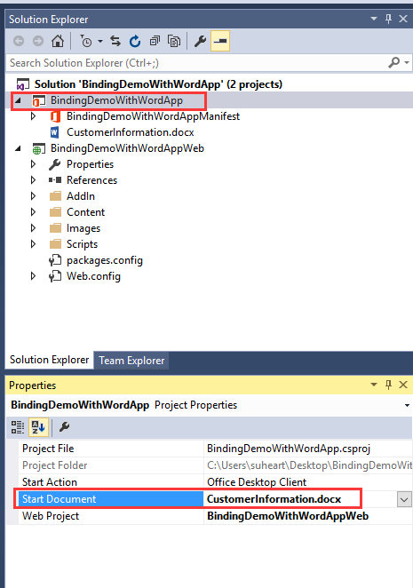
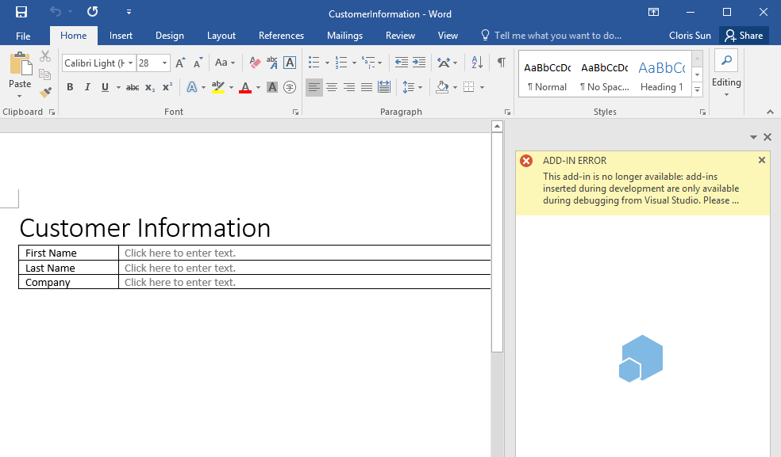
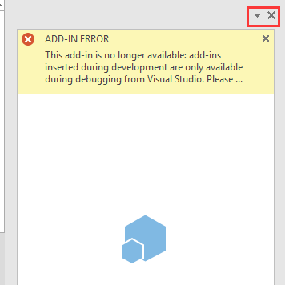
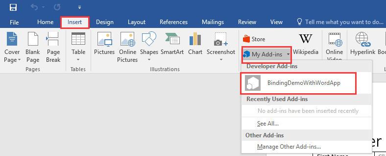
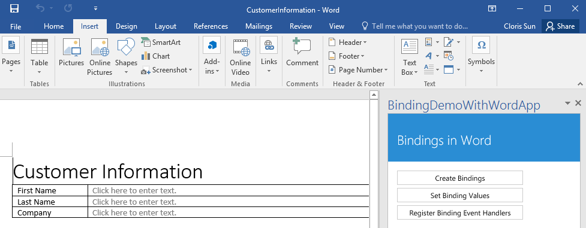
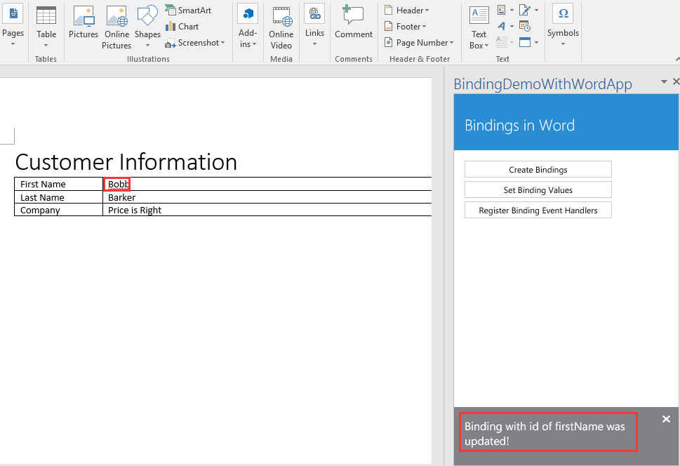

# Demo BindingDemoWithWordApp

1. Open the BindingDemoWithWordApp solution using Visual Studio 2015
2. Select the BindingDemoWithWordApp project. Set the **Start Document** property value to **CustomerInformation.docx**.

    

3. Press the **{F5}** key to run the project. The debugger should launch **CustomerInformation.docx** and you should see your Office Add-in in the task pane on the right side of Word document.

    

4. **Close** the Add-in Task Pane.

    

5. Click **Insert > My Add-ins**, then select the **BindingDemoWithWordApp** Add-In.

    

6. The **BindingDemoWithWordApp** Add-In now appears in the Task Pane.

    

7. Click the **Create Bindings** button, to create bindings in the document whose ids equal **firstName**, **lastName**, and **company**.

9. Click the **Set Binding Values** button. The three bindings created in the step above have their values set programmatically.
   
    

10. Click the **Register Binding Event Handlers** button to register event handlers for the bindings. Then, change the value of **First Name**, **Last Name** or **Company**. 

    

11. Notice the message box indicates which binding value has been changed.

    