# Deep Dive into Apps for Office with PowerPoint

In this lab you will get hands-on experience developing an App for Office which targets Microsoft PowerPoint.

**Prerequisites:** 
1. Before you can start this lab, you must have installed Office 2013 with Service Pack 1 and Visual Studio 2013 with Update 4 on your development workstation.
1. You must have the Office 365 API Tools version 1.4.50428.2 installed in Visual Studio 2013 & Update 4 installed.

## Exercise 1: Creating the PowerPointTV App for Office Project
*In this exercise you will create a new App for Office project in Visual Studio so that you can begin to write, test and debug an App for Office which targets Microsoft PowerPoint.*

1. Launch Visual Studio 2013 as administrator.
1. From the **File** menu select the **New Project** command. When the **New Project** dialog appears, select the **App for Office** project template from the **Office/SharePoint** template folder as shown below. Name the new project **PowerPointTV** and click **OK** to create the new project.  

	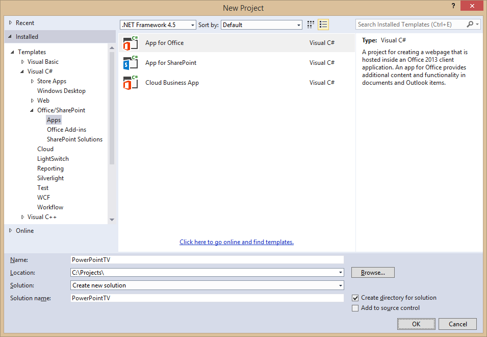

1. When you create a new App for Office project, Visual Studio prompts you with the **Choose the app type** page of the **Create app for Office** dialog. This is the point where you select the type of App for Office you want to create. Select the setting with the radio button titled **Content** and select **Next** to continue.  
	
	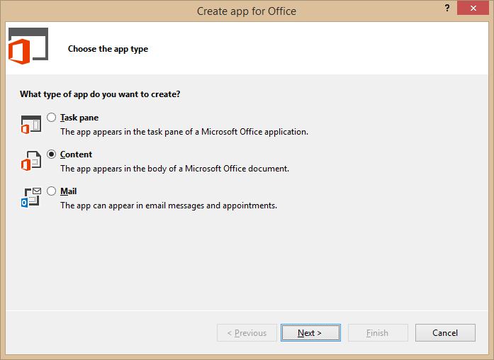

1. On the **Choose the host applications** page of the **Create app for Office** dialog, uncheck all the Office application except for **PowerPoint** and then click **Finish** to create the new Visual Studio solution.  

	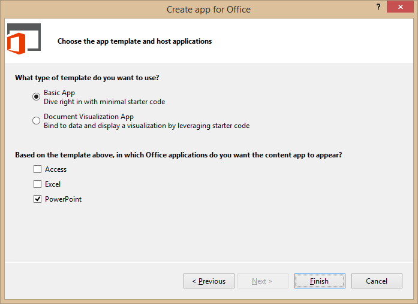

1. Take a look at the structure of the new Visual Studio solution once it has been created. At a high-level, the new solution has been created using two Visual Studio projects named **PowerPointTV** and **PowerPointTVWeb**. You should also observe that the top project contains a top-level manifest for the app named **PowerPointTVManifest** which contains a single file named **PowerPointTV.xml**.  

	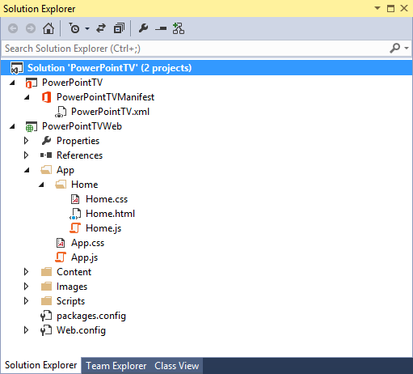

1. In the Solution Explorer, double-click on the node named **PowerPointTVManifest** to open the app manifest file in the Visual Studio designer. Update the **Display Name** settings in the app manifest from **PowerPointTV** to **PowerPoint TV App**.  

	  

1. Move down in **PowerPointTVManifest** and locate the **Requested width** setting. Modify **Requested width** to *1000* pixels.  

	

1. Save and close **PowerPointTVManifest**.
1. Over the next few steps you will walk through the default app implementation that Visual Studio generated for you when the app project was created. Begin by looking at the structure of the **app** folder which has two important files named **app.css** and **app.js** which contain CSS styles and JavaScript code which is to be used on an app-wide basis.

	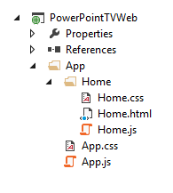

1. You can see that inside the **app** folder there is a child folder named **Home** which contains three files named **Home.html**, **Home.css** and **Home.js**. Note that the app project is currently configured to use **Home.html** as the app's start page and that **Home.html** is linked to both **Home.css** and **Home.js**. 
1. Double-click on **app.js** to open it in a code editor window. you should be able to see that the code creates a global variable named **app** based on the JavaScript *Closure* pattern. The global **app** object defines a method named **initialize** but it does not execute this method. 

	````javascript 
	var app = (function () {
	  "use strict";

	  var app = {};

	  // Common initialization function (to be called from each page)
	  app.initialize = function () {
	    $('body').append(
		  '<div id="notification-message">' +
		  '<div class="padding">' +
		  '<div id="notification-message-close"></div>' +
		  '<div id="notification-message-header"></div>' +
		  '<div id="notification-message-body"></div>' +
		  '</div>' +
		  '</div>');

		  $('#notification-message-close').click(function () {
		    $('#notification-message').hide();
		  });


		  // After initialization, expose a common notification function
		  app.showNotification = function (header, text) {
		    $('#notification-message-header').text(header);
		    $('#notification-message-body').text(text);
		    $('#notification-message').slideDown('fast');
		  };
		};

		  return app;
	})();
	````

1. Close **app.js** and be sure not to save any changes.
1. Next you will examine the JavaScript code in **home.js**. Double-click on **home.js** to open it in a code editor window. Note that **Home.html** links to **app.js** before it links to **home.js** which means that JavaScript code written in **Home.js** can access the global **app** object created in **app.js**.
1. Walk through the code in **Home.js** and see how it uses a self-executing function to register an event handler on the **Office.initialize** method which in turn registers a document-ready event handler using jQuery. This allows the app to call **app.initialize** and to register an event handler using the **getDataFromSelection** function. 
 
	````javascript
	(function () {
	  "use strict";

	  // The initialize function must be run each time a new page is loaded
	  Office.initialize = function (reason) {
	    $(document).ready(function () {
	      app.initialize();
	      $('#get-data-from-selection').click(getDataFromSelection);
	    });
	  };

	  // Reads data from current document selection and displays a notification
	  function getDataFromSelection() {
	    Office.context.document.getSelectedDataAsync(Office.CoercionType.Text,
	      function (result) {
	        if (result.status === Office.AsyncResultStatus.Succeeded) {
	          app.showNotification('The selected text is:', '"' + result.value + '"');
	        } else {
	          app.showNotification('Error:', result.error.message);
	      }
		});
	  }
	})();
	````

1. Delete the **getDataFromSelection** function from **Home.js** and also remove the line of code that binds the event handler to the button with the id of **get-data-from-selection** so your code matches the following code listing.

	````javascript
	(function () {
	  "use strict";

	  // The initialize function must be run each time a new page is loaded
	  Office.initialize = function (reason) {
	    $(document).ready(function () {
	      app.initialize();
	      // your app initialization code goes here
	    });
	  };

	})(); 
	````

1. Save your changes to **Home.js**. You will return to this source file after you have added your HTML layout to **Home.html**.
1. Now it time to examine the HTML that has been added to the project to create the app's user interface. Double-click **Home.html** to open this file in a Visual Studio editor window. Examine the layout of HTML elements inside the body element. 

	````html
	<body>
		<div id="content-header">
			<div class="padding">
				<h1>Welcome</h1>
			</div>
		</div>
		<div id="content-main">
			<div class="padding">
				<p><strong>Add home screen content here.</strong></p>
				<p>For example:</p>
				<button id="get-data-from-selection">Get data from selection</button>

				<p style="margin-top: 50px;">
					<a target="_blank" href="https://go.microsoft.com/fwlink/?LinkId=276812">Find more samples online...</a>
				</p>
			</div>
		</div>
	</body>
	````

1. Replace the text message of **Welcome** inside the **h1** element with a different message such as **Loan Information**. Also trim down the contents of the **content-main** div element to match the HTML code shown below. You will start off your HTML layout using a single div element with an id of **player**.

	````html
	<body>
	  <div id="content-main">
			<div id="player"></div>
	  </div>
	</body>
	````

19. Save and close **Home.html**.
20.	Return to **Home.js** and modify to code to write a simple message to the **results** div using the following code.

	````javascript
	(function () {
	    "use strict";

	    // The initialize function must be run each time a new page is loaded
	    Office.initialize = function (reason) {
	        $(document).ready(function () {
	            app.initialize();
	            $('#player').text("Hello world");
	        });
	    }

	})();
	````

1. Now it's time to test the app using the Visual Studio debugger. Press the **{F5}** key to run the project in the Visual Studio debugger. The debugger should launch Microsoft PowerPoint 2013 and you should see your **PowerPointTV** app in the task pane on the right side of a new PowerPoint presentation as shown in the following screenshot.

	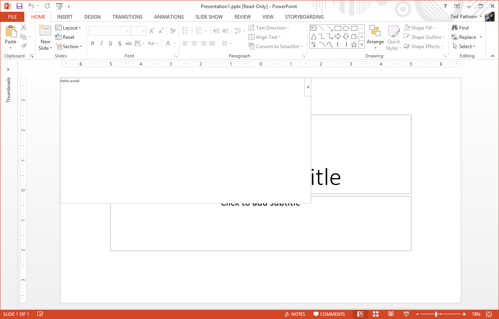

1.	Inside the PowerPoint slide, select the content app and center it in the middle of the slide. If you'd like, change the PowerPoint presentation theme to give the slide background some color.  

	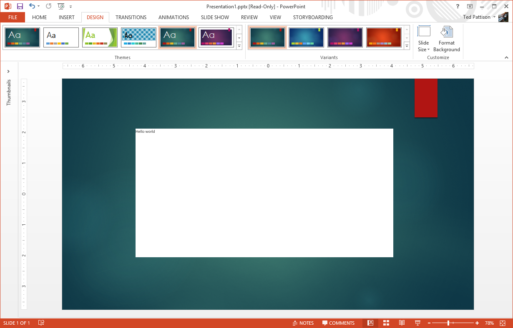

1.	Save the PowerPoint presentation as a file named **TestDec.pptx** and make sure to save this file in the root folder of the **PowerPointTV** project.
1.	In Visual Studio, add the file **TestDec.pptx** into **PowerPointTV** project.

	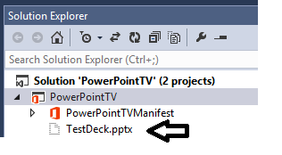

1.	Select the **PowerPointTV** project and then navigate to the property sheet and change the **Start Document** setting to **TestDeck.pptx**. 

	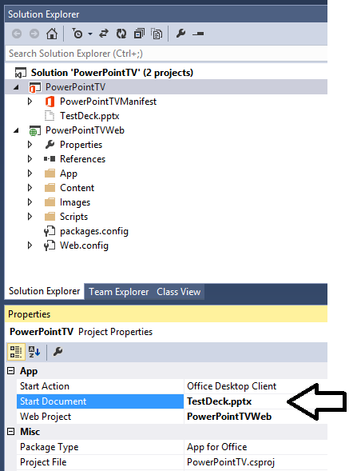 

1. Test your work by pressing **{F5}** and starting a debugging session. The debugging session should load and initialize the app using **TestDeck.pptx** instead of a new PowerPoint presentation.
1. Close PowerPoint to terminate your debugging session and return to Visual Studio.

## Exercise 2: Programming the PowerPointTV App to Load YouTube Videos
*In this exercise, you will continue working on the PowerPointTV app project you created in the previous exercise by extending with a custom YouTube video player.*

1. Make sure you have the **PowerPointTV** app open in Visual Studio. If the project is not open, open it now.
1. Open **Home.css** and add the following CSS rule.

	````css
	#content-main{
		background-color: black;
		padding: 4px;
	}
	````

1. Save and close **Home.css**.
1. Open **Home.js** and replace the code inside using the code shown in the following code listing.

	````javascript
	(function () {
		"use strict";		
		// The initialize function must be run each time a new page is loaded
		Office.initialize = function (reason) {
			$(document).ready(function () {
				app.initialize();
				// your app initialization code goes here		
				var tag = document.createElement('script');
				tag.src = "https://www.youtube.com/iframe_api";
				var firstScriptTag = document.getElementsByTagName('script')[0];
				firstScriptTag.parentNode.insertBefore(tag, firstScriptTag);		
			});
		};		
	})();

	        // add support for YouTube player
	var player;

	function onYouTubeIframeAPIReady() {		
		var videoId = 'Y0hsjr7S-kM';		
		player = new YT.Player('player', {
			height: '390',
			width: '640',
			videoId: videoId,
			events: {
				'onReady': onPlayerReady
			}
		});

	}
			
	function onPlayerReady(event) {
		event.target.playVideo();
	}
	````

1. Save your changes to **Home.js**.
1. Test your work by pressing **{F5}** to start a debugging session. You should see that the app displays and plays a video from youtube.  

	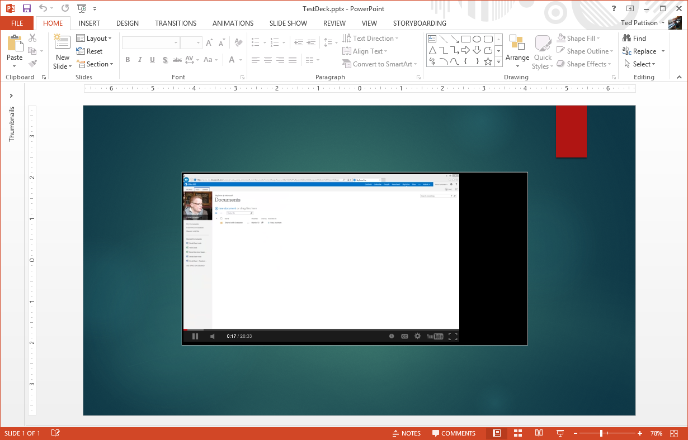

1. Open **Home.html** and update the body element with the following HTML.

	````html
	<body>
		<div id="content-main">
			<div id="player"></div>
			<div id="control_panel">
				<div>
					<button id="cmdStart">Start</button>
					<button id="cmdPause">Pause</button>
					<button id="cmdStop">Stop</button>
				</div>
				<div>
					<select size="10" id="videoList"></select>
				</div>
			</div>
		</div>
	</body>
	````

1. Save and close **Home.html**.
1. Open **Home.css** and update it to match the following code listing.

	````css
	#content-main{
		background-color: black;
		padding: 4px;
	}

	#player {
		float: left;
	}

	#control_panel {
		background-color: #DDD;
		padding: 8px;
		margin-left: 644px;
	}

	#control_panel select {
		width: 100%;
	} 
	````

1. Save and close **Home.css**.
1. Open **Home.js**.
1. At the bottom of **Home.js**, add the following three function named **onStart**, **onPause** and **onStop**.

	````javascript		
	function onStart() {
		player.playVideo();
	}

	function onPause() {
		player.pauseVideo();
	}

	function onStop() {
		player.stopVideo();
	}
	````

1.	At the bottom of the document ready handler, add code to register the click event handler for the three button.

	````javascript
	Office.initialize = function (reason) {
		$(document).ready(function () {
			app.initialize();
			// your app initialization code goes here

			var tag = document.createElement('script');
			tag.src = "https://www.youtube.com/iframe_api";
			var firstScriptTag = document.getElementsByTagName('script')[0];
			firstScriptTag.parentNode.insertBefore(tag, firstScriptTag);

	                // register event handlers for control panem buttons
			$("#cmdStart").click(onStart);
			$("#cmdPause").click(onPause);
			$("#cmdStop").click(onStop);

		});
	};
	````

1. Test your work by pressing **{F5}** to start a debugging session. You should see that the app displays and plays a video from youtube just as before. However, now the three buttons should work and allow you to play, pause and stop the video.  

	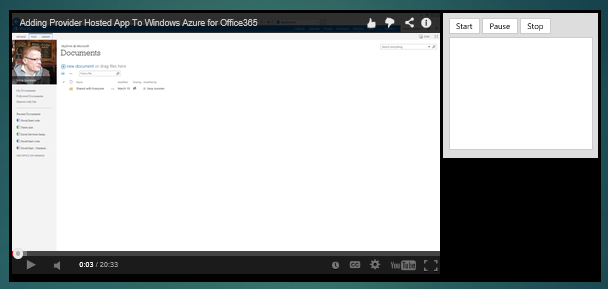

1. Close PowerPoint to terminate your debugging session and return to Visual Studio.


## Exercise 3: Programming the PowerPointTV App to Load YouTube Videos
*In this exercise, you will continue working on the PowerPointTV app project you created in the previous exercise by extending with a custom web service to supply the app with a list of videos.*

1. Make sure you have the **PowerPointTV** app open in Visual Studio. If the project is not open, open it now.
1. Add a new folder the **PowerPointTVWeb** project named **Controllers**.  

	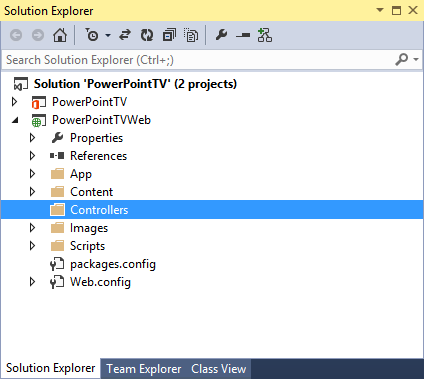  

1. Right-click on the **Controllers** folder and select **Add > Controller**.
1. In the **Add Scaffold** dialog, select **Web API 2 Controller - Empty** and click the **Add** button.  

	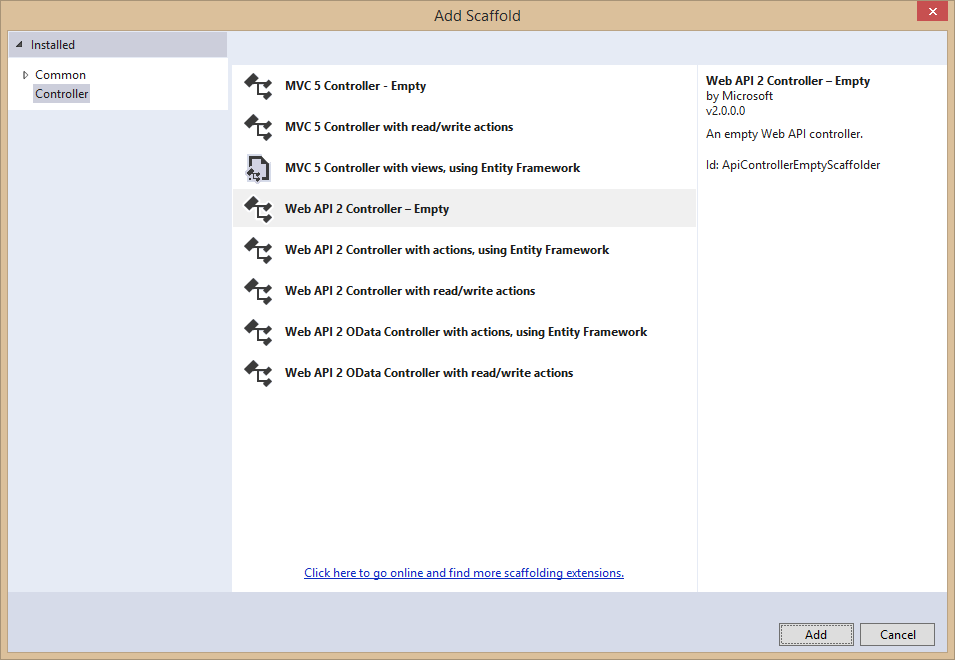    

1. On the **AddController** dialog, enter a name of **VideosController** and click the **Add** button.  

	  

1. You should now see that the Web API controller has been added to a file named **VideosController.cs**. You can also see that Visual Studio has added a few extra files such as **Global.asax** and **WebApiConfig.cs** to provide support for the Web API.  

	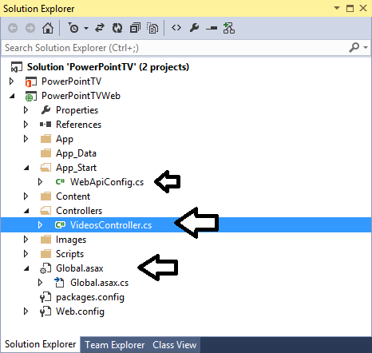

1. Examine what's inside **VideosController.cs**. You can see that there is an **ApiController**-derived class named **VideosController** which is initially empty.

	````c#
	using System;
	using System.Collections.Generic;
	using System.Linq;
	using System.Net;
	using System.Net.Http;
	using System.Web.Http;

	namespace PowerPointTVWeb.Controllers
	{
	    public class VideosController : ApiController
	    {
	    }
	}
	````

1. Just above the **VideosController** class, add a new class named **VideoInfo** using the following code.

	````c#
	namespace PowerPointTVWeb.Controllers {

		public class VideoInfo {
			public string videoId { get; set; }
			public string title { get; set; }
		}

		public class VideosController : ApiController {
		}
	}
	````

1. Implement a **Get** method in the **VideosController** class using the following code.

	````c#
	public class VideosController : ApiController {
		public IEnumerable<VideoInfo> Get() {
			return new List<VideoInfo>() {
				new VideoInfo{videoId="Y0hsjr7S-kM", title="Adding Provider Hosted App To Windows Azure for Office365"},
				new VideoInfo{videoId="GbYzzubLGEI", title="Async Site Collection Provisioning With App Model for Office365"},
				new VideoInfo{videoId="_Duwtgn9rhc", title="Building Connected SharePoint App Parts With SignalR"},
				new VideoInfo{videoId="m2R8Bfb9Qss", title="Scot Hillier on what makes IT Unity Special"}
			};
		}
	}
	````

1. Save and close **VideosController.cs**.
1. Open **Home.js** and add two functions named **onLoadVideo** and **loadVideos** at the bottom of the file.

	````javascript
	function loadVideos() {

		// call Videos web service using URL of /api/Videos/  
		$.ajax({
			url: "/api/Videos/",
		}).done(function (videos) {
	                // handle async response from web service call
			// make sure select list is empty
			$("#videoList").empty();
			// add option element for each video
			for (var i = 0; i < videos.length; i++) {
				$("#videoList").append($("<option>", { value: videos[i].videoId }).text(videos[i].title));
			}
			// attach click event handler to select list
			$("#videoList").click(onLoadVideo);
		});

	}

	function onLoadVideo() {
		var videoId = $("#videoList").val();
		if (videoId) {
			player.loadVideoById(videoId);
		}
	}
	````

1. At the end of the app initialization code, add a call to the **loadVideos** function.

	````javascript
	Office.initialize = function (reason) {
		$(document).ready(function () {
			app.initialize();

			var tag = document.createElement('script');
			tag.src = "https://www.youtube.com/iframe_api";
			var firstScriptTag = document.getElementsByTagName('script')[0];
			firstScriptTag.parentNode.insertBefore(tag, firstScriptTag);

			$("#cmdStart").click(onStart);
			$("#cmdPause").click(onPause);
			$("#cmdStop").click(onStop);

	        // call to Videos web service
			loadVideos();

		});
	};
	````

1. Test your work by pressing **{F5}** to start a debugging session. The app should fill the select element with a list of videos using data retrieved from the web service call. You should also be able to change the currently playing video by clicking one of the videos titles in the list of videos.  

	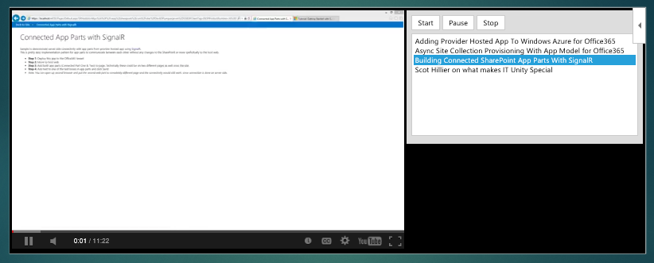

Congratulations! You have now completed this lab.