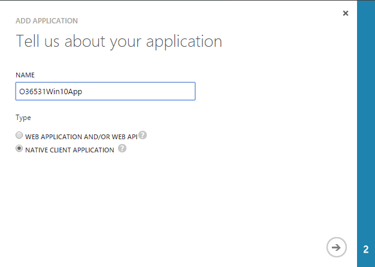
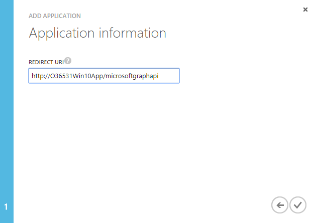
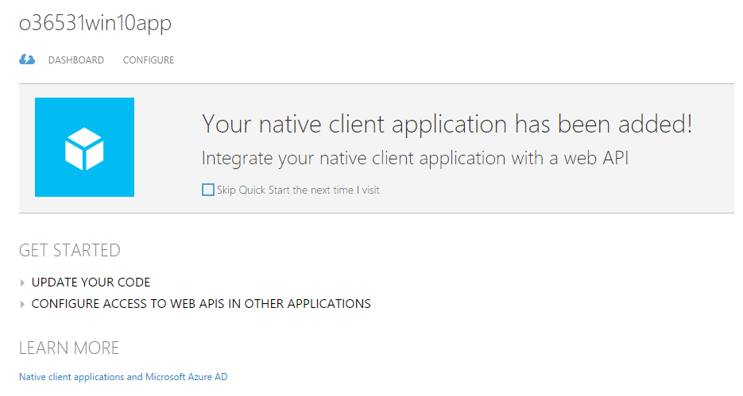
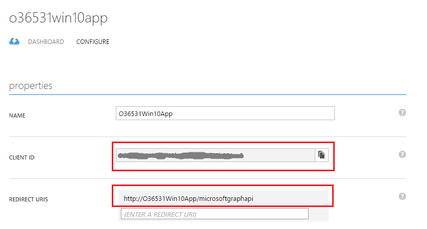
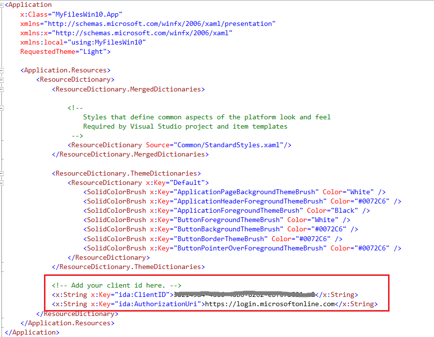
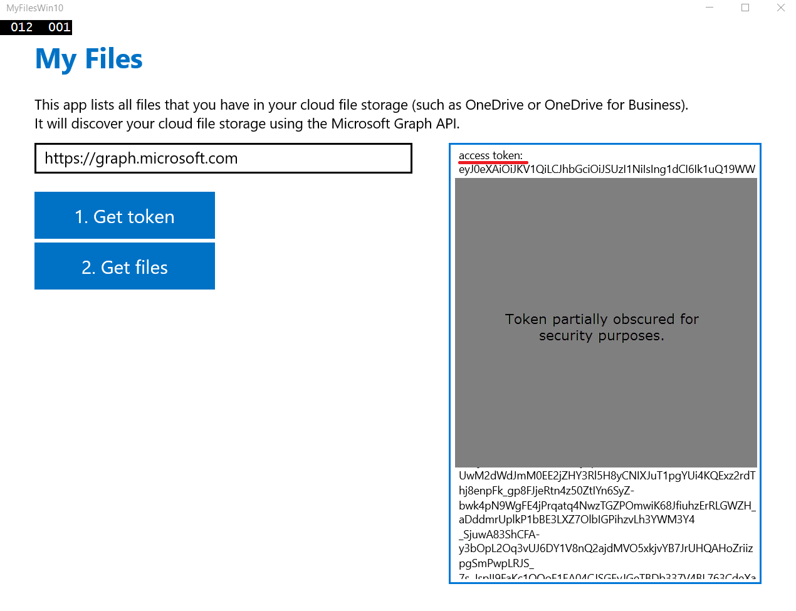
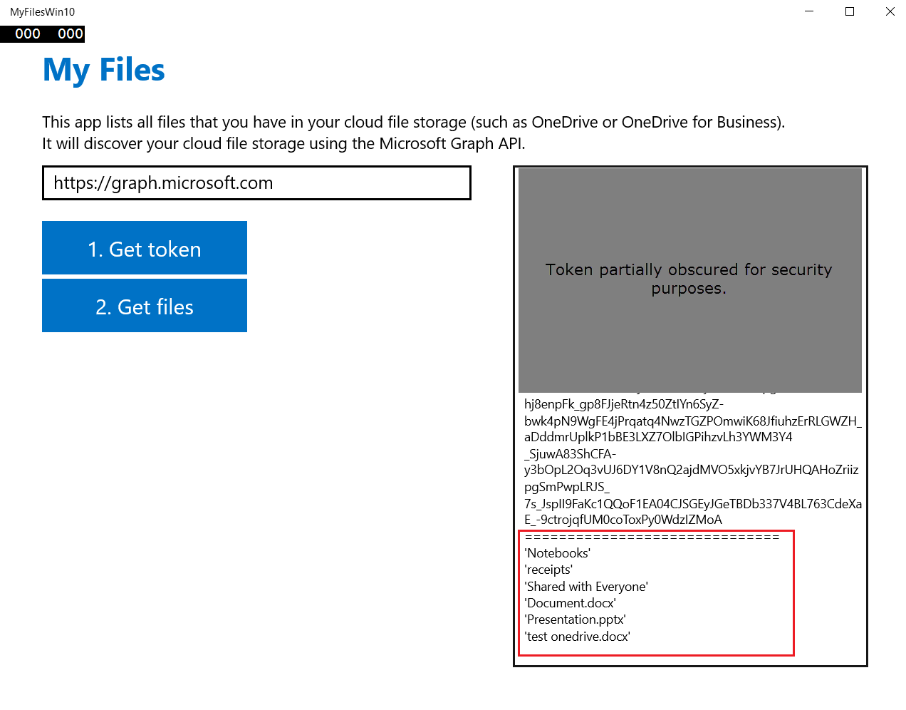

#Deep Dive into Azure AD with the Microsoft Graph

In this lab you will explore the Microsoft Graph using a Windows Store App.

## Prerequisites
1. You must have an Office 365 tenant and Windows Azure subscription to complete this lab. If you do not have one, the lab for **O3651-7 Setting up your Developer environment in Office 365** shows you how to obtain a trial.
1. You must have Visual Studio 2015.
1. This lab requires you to use multiple starter files or an entire starter project from the GitHub location. You can either download the whole repo as a zip or clone the repo https://github.com/OfficeDev/TrainingContent.git for those familiar with git.

## Exercise 1: Use the Microsoft Graph in a Native Client Application and Configure the Starter Project
In this exercise, you will use the Microsoft Graph within a Windows 10 application. 

### Register your application with Azure Active Directory
*Your custom Windows 10 application must be registered as an application in Azure AD in order to work, so we will do that now.*

1. Sign into the [Azure Management Portal](https://manage.windowsazure.com/ "Azure Management Portal") using your Office 365 Developer Site credentials.
2. Click **Active Directory** on the left menu, then click on the **directory** for your Office 365 developer site.
3. On the top menu, click **Applications**.
4. Click **Add** from the bottom menu.
5. On the **What do you want to do** page, click **Add an application my organization is developing**.
6. On the **Tell us about your application** page, specify **O36531Win10App** for the application name and select **NATIVE CLIENT APPLICATION** for Type.

7. Click the arrow icon on the bottom-right corner of the page.
8. On the Application information page, specify a Redirect URI, for this example, you can specify http://O36531Win10App/microsoftgraphapi. Click the checkbox on the bottom-right corner of the page.

9. Once the application has been successfully added, you will be taken to the Quick Start page for the application. From here, click **Configure** on the top menu.

10. In **permissions to other applications**, click **Add application**.

11. Click **Microsoft Graph**, and then click the check mark icon. 

12. Under **permissions to other applications**, click the **Delegated Permissions** column for **Microsoft Graph**
    - Read files that the user selects
	- Read user files and files shared with user	
	- Sign in and read user profile
13. Click **Save**
14. Copy the value specified for **Client ID** and **REDIRECT URIS**; you will need this later when coding the **MyFilesWin10** project.


### Prepare the Visual Studio Solution

> This lab requires you to use multiple starter files or an entire starter project from the GitHub location. You can either download the whole repo as a zip or clone the repo https://github.com/OfficeDev/TrainingContent.git for those familiar with git.

1. Locate the starter project in the Starter project folder within this lab located at [\\\O3653\O3653-1\O3653-1 Deep Dive into Azure AD with the Office 365 APIs\Lab\Starter](Lab/Starter). Open the Visual Studio solution **MyFilesWin10.sln** in Visual Studio 2015.
1. In the Solution Explorer, right-click the **MyFilesWin10** solution node and select **Manage Nuget Packages for Solution**.
1. Click the **Updates** tab.
1. Select the **Select all Packages** checkbox.
1. Click the **Update** button.
1. Click **OK**.
1. Click **I Accept**.
1. Add the Azure AD application's client ID to the project. Open the **App.xaml** file and locate the XML element with the string **ida:ClientID** in it. Enter your Client ID.


## Exercise 2: Add class to implement authentication and represent the data returned from the Microsoft Graph.
In this exercise, you will add an authentication class to get access token for Microsoft Graph. Then use this access token to get my files.

*Note: The code listed in this lab can be found in the [\\\O3653\O3653-1 Deep Dive into Azure AD with the Office 365 APIs\Lab\Labfiles](Lab/Labfiles) folder.*

1. Assembly references are not added to the shared projects in Universal Apps, rather they are added to the actual client projects. Therefore you need to add the following NuGet packages manually.
	1. Open the Package Manager Console: **View/Other Windows/Package Manager Console**.
	1. Enter each line below in the console, one at a time, pressing **ENTER** after each one. NuGet will install the package and all dependent packages:
	
		````powershell
		PM> Install-Package -Id Microsoft.IdentityModel.Clients.ActiveDirectory		
		````

1. Add a class to facilitate the authorization to Azure / Office 365:
	1. In **Solution Explorer**, right-click on the **MyFilesWin10** project and choose **Add/New Item...**
	1. In the **Add New Item** dialog, select **Class** and enter the name **AuthenticationHelper**.
	1. Locate the [\\\O3653\O3653-1 Deep Dive into Azure AD with the Office 365 APIs\Lab\Labfiles](Lab/Labfiles) folder provided with this lab & find the file [`AuthenticationHelper.cs`](/O3653/O3653-1%20Deep%20Dive%20into%20Azure%20AD%20with%20the%20Office%20365%20APIs/Lab/Labfiles/AuthenticationHelper.cs). Copy the contents of the [`AuthenticationHelper.cs`](/O3653/O3653-1%20Deep%20Dive%20into%20Azure%20AD%20with%20the%20Office%20365%20APIs/Lab/Labfiles/AuthenticationHelper.cs) file and paste in into the AuthenticationHelper.cs class you just created in Visual Studio, overwriting all the content in the class Visual Studio generated.
    1. Update the login redirect URI for the application that is sent to Azure when logging in. Locate the line that looks like this:

		````c#
		private static Uri redirectUri = new Uri(" ");
		````
		
		Set the value of that string **http://O36531Win10App/microsoftgraphapi**.

1. In **Solution Explorer**, expand the **MyFilesWin10** project. Locate and open the file **MainPage.xaml.cs**
	1. In the **TokenButton_Click** method, Locate the following comment block:

		````c#    
	    // Get access token for the target service
		````
	
		Add the following code snippet under the comment block:

		````c#
		string accessToken = await AuthenticationHelper.GetGraphAccessTokenAsync();

        m_settings = new Dictionary<string, string>();
        m_settings["access_token"] = accessToken;

        this.Status.Text += "access token:\n";
        this.Status.Text += accessToken + "\n";       
		````

    1. In the **GetFilesAsJsonAsync** method, locate the following comment block:

		````c#
		//get my files
		````

		Add the following code snippet under the comment block:

		````c#
		var accessToken = m_settings["access_token"];
        // Build request
        var url = string.Format("{0}me/drive/root/children", AuthenticationHelper.ResourceBetaUrl);

        var request = HttpWebRequest.CreateHttp(url);
        request.Method = "GET";
        request.Accept = "application/json";
        request.Headers["Authorization"] = "Bearer " + accessToken;

        // Get response
        var response = await request.GetResponseAsync()
                                        .ConfigureAwait(continueOnCapturedContext: true)
                            as HttpWebResponse;
        var responseReader = new StreamReader(response.GetResponseStream());
        var responseBody = await responseReader.ReadToEndAsync()
                                                    .ConfigureAwait(continueOnCapturedContext: true);

        if (response.StatusCode == HttpStatusCode.OK)
        {
            // Parse the JSON result
            var jsonResult = JsonObject.Parse(responseBody);
            return jsonResult;
        }

        // Consent was not obtained
        this.Status.Text += string.Format("Request failed. Status: '{0}', Body: '{1}'\n",
                                        response.StatusCode,
                                        responseBody);
        this.Status.Foreground = ErrorBrush;
		````		
    
1. Configure the debug mode in VS to match the screenshot below and press **F5** to run the program.

   

1. Click the **Get token** button. The access token is printed in the output box.

   

1. Click the **Get files** button. Explore the file list in the output box.

   


You have completed the lab for this module.