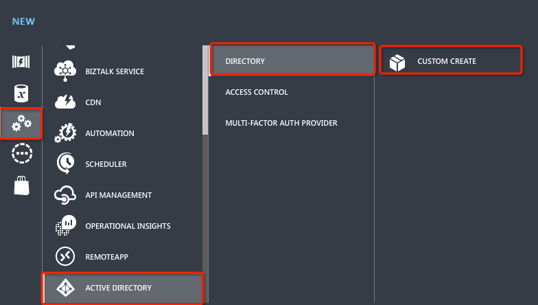
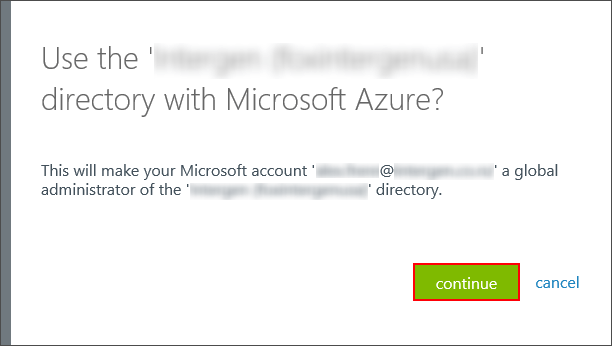
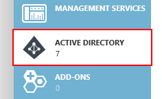
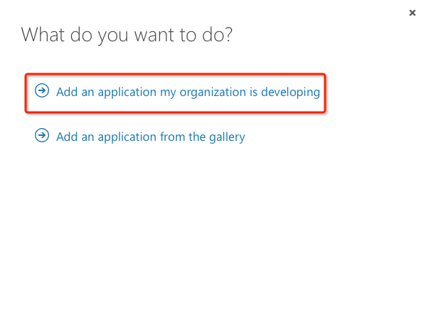
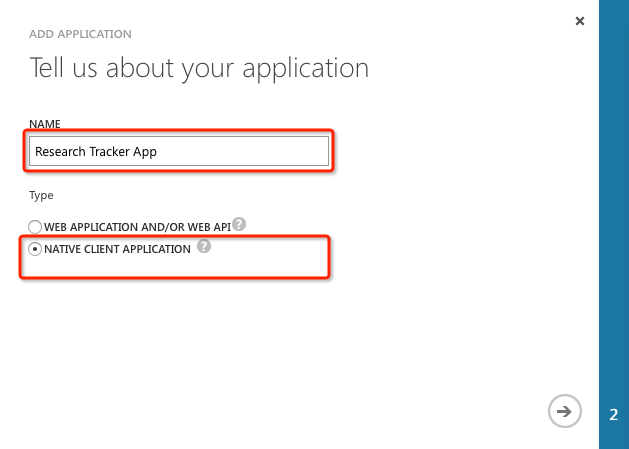
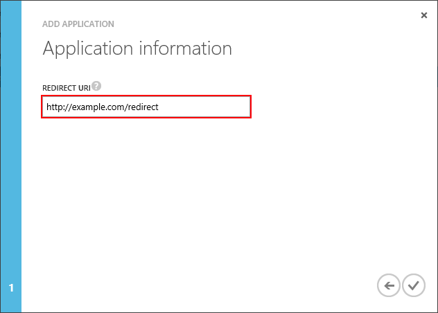
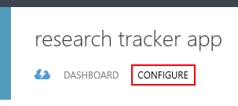
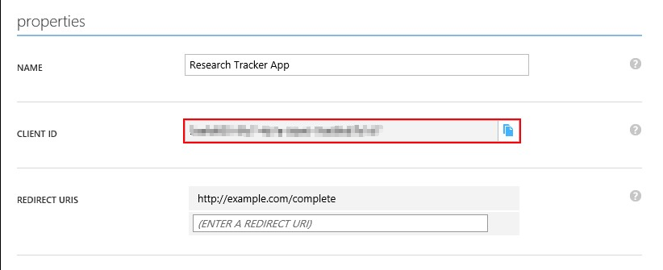
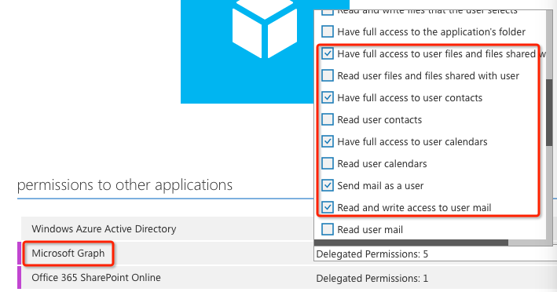
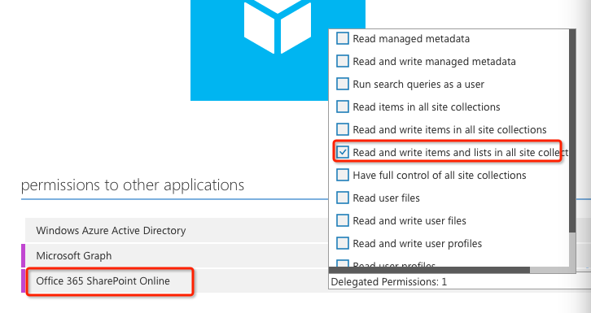

Configuring your Office 365 Tenant
==================================

## Overview

The lab steps through the steps required to configure your Office 365 Tenant for authentication from your Android or iOS app.

## Objectives
- Connect your Office 365 directory to your Azure subscription
- Add an Application to your Office 365 Tenant's Active Directory to allow authentication from your Android or iOS app.

## Prerequisites

- [An Office 365 tenancy][sign-up-for-o365]
- [An Azure subscription][azure-management-portal]

[sign-up-for-o365]: http://office.microsoft.com/en-nz/business/office-365-enterprise-e3-business-software-FX103030346.aspx
[azure-management-portal]: https://manage.windowsazure.com/

## Tasks

The hands-on lab includes the following exercises:

- [**Task 1:**](#task1) Connect your Office 365 directory to your Azure subscription

- [**Task 2:**](#task2) Create a new Application in your Office 365 directory for your Android or iOS app

## Task 1: Connect your Office 365 directory to your Azure subscription

Here we will associate your Azure account with your Office 365 tenant as a global administrator.
This gives you the ability to manage the Office 365 directory using the Azure portal.

01. Sign into the [Azure Portal](https://manage.windowsazure.com/)

02. Click **+ New**

    

03. Select **App Services > Active Directory > Directory > Custom Create**

    

04. Select **Use existing directory**, and then **I am ready to be signed out now**

    

05. You will be signed out of the portal and redirected to a sign-in page. Sign in using the credentials for a global administrator in your Office 365 tenant.

    

06. When authenticated click **continue**. This will add your Azure account as a global administrator of the Office 365 directory.

    

07. Click **Sign out now** and when prompted sign back into your Azure account.

    

You have successfully associated your Azure account with your Office 365 tenant as a global administrator.
This gives you the ability to manage the Office 365 directory using the Azure portal.

## Task 2: Create a new Application in your Office 365 directory for your Android or iOS app

Here we will create an Application in your Office 365 directory to allow your Android or iOS app to authenticate and interact with the Office 365 Exchange and SharePoint APIs

01. When you're signed back in, navigate to your Office 365 directory in the Active Directory extension.

    

02. And then navigate to the **Applications** tab.

    

03. Select **Add** from the action bar to add a new Application.
    
    

04. Select **Add an application from my Organization**. Click **Next**.
    
    

05. Enter a name for the application, and select **Native Client Application**. Click **Next**.

    

06. Enter the following redirect URI for the application:

        http://example.com/redirect

    > **NOTE:** this url does not need to resolve to anything, but we will later configure our mobile app with this same url.

    

07. Click **Next**.

08. The application is created. Navigate to the **Configure** tab.

    

09. And copy down the **Client Id**.

    

10. Scroll down to the **permissions to other applications** section. 

11. Click the **Add Application** button.

12. In the **Permissions to other applications** dialog, click the **PLUS** icon next to the **Microsoft Graph** option.

13. Click the **CHECK** icon in the lower left corner.
 
14. For the new **Microsoft Graph** application permission entry, select the **Delegated Permissions** dropdown on the same line and then select the following permissions:
    * Read and write access to users' mail
    * Send mail as user
    * Have full access to users' calendars
    * Have full access to users' contacts
    * Have full access to user files and files shared with user

    

12. Again from the Select application dropdown, add **Office 365 SharePoint Online**.

13. From **Delegated Permissions** select the following:

    * Read and write items and lists in all site collections

    This configures your app to have delegated permission to access user data in SharePoint.

    

14. Click **Save** to save the changes.

    

You have successfully created an Application in your Office 365 directory to allow your Android or iOS app to authenticate and interact with the Microsoft Graph and SharePoint APIs
