## Module 9 - Using Search Capabilities with CAM Patterns

### Lab Environment
During this lab, you will work in your own environment with your own Office365 tenant. Following pre-requisites should be completed or be available before you start the lab.

### Prerequisites

The required prerequisite for this course are:

* Basic skill set on managing Office365
* Access to an Office365 tenant with an existing developer site. (The [pre-requisite lab](../1 Introduction to app model transition/Lab.md) provides directions to complete this task.)
* Visual Studio 2013 Ultimate with Azure SDK v2.5
* Ensure you have configured a local NuGet package repository: [](http://www.mbgreen.com/blog/2014/8/8/sharepoint-2013-apps-fail-on-nuget-package-restore)
* Access to an existing Windows Azure tenant (to be used as the hosting platform for applications that are installed for a typical Office365 sites.) 
* SharePoint Designer 2013. 
* Download and install the latest version of the SharePoint online client SDK from following link - http://aka.ms/spocsom
* Download the [O3658-9 Demos.zip](Demos/O3658-9 Demos.zip) zip file by following the link and clicking on **Raw**, then extract it. Note the location of these files. You will need these files to complete the labs.
## Exercise 1: Build Personalized Search Aggregations
### Abstract
In this lab you will build personalized search results based on a particular user's user profile property values.

### Learning Objectives
After completing the exercises in this lab, you will be able to:

* Use Search CSOM to access crawled information in the sites.
* Combine Social CSOM and Search CSOM to provide personalized results.

#### Estimated time to complete this lab: 15 minutes

### Set up the solution properties and check the starting point.
In this task we will take the just created theme file and the background image, and we will deploy and apply a new theme to host web from provider hosted app.

1.  Start **Visual Studio 2013.**
2.  Click __File | Open Project.__  
  
3.  Move to the __O3658-9 Demos/PersonalizedSearchResults__ folder and open the existing solution named __PersonalizedSearchResults.sln__.
    *   Notice that the actual folder location is dependent on where you copied the files to in your local computer  
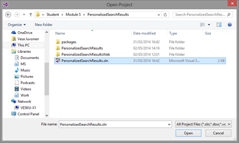  
4.  Provide your tenant login information when the __Connect to SharePoint__ dialog is prompted.  
  
5.  Ensure that the __Site URL__ property is correct for the App project by first activating the __PersonalizedSearchResults__ project in the __Solution Explorer__.  
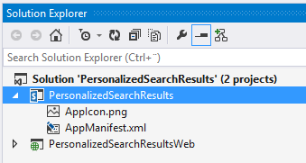  
6.  Confirm the __Site URL__ from the property window. This this should be pointing to your personal Office365 tenant and to the existing developer site collection which can be used for the exercise creation.  
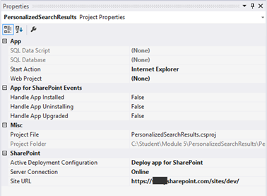  
7.  Open __AppManifest.xml__ from the app project in the __Solution Explorer__.  
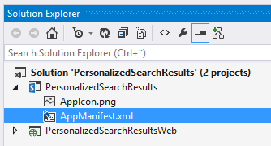  
8.  Move to the __Permissions__ tab.
9.  Adjust the permission to require __Mange__ for __Web__ scope, __Read__ for __User profiles (Social)__ and __QueryAsUserIgnoreAppPrincipal__ for __Search__. This will ensure that we have all the required permissions that the upcoming requirements need.  
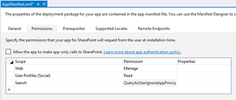  
10. Press __F5__ or choose __Debug | Start Debugging__ to ensure that application can be properly deployed.
11. Log in to your test tenant by providing the right user ID and password, if required.  
  
    *   Notice that if you have any challenges to logging in from your corporate tenant, follow this support article: [support.microsoft.com/kb/2507767](http://support.microsoft.com/kb/2507767).  
12. Click Trust It, when the trust notification for the oAuth permissions is shown.  
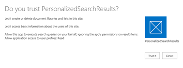  
13. You should now see the initial design for the app as follows.  
    *   Notice that we will implement the actual functionality as an app part, so there won’t be any actual code in default.aspx.  
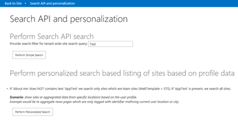  
14. Move back to the __Visual Studio__ side and press __Shift+F5__ or choose __Stop Debugging__ from the Debug menu.

### Add the code to perform search operations.
In this task we will add the needed references and implement the search operations for the button clicks.

1.  Right click the __References__ under the project in the __Solution Explorer__ and choose __Add Reference...__.
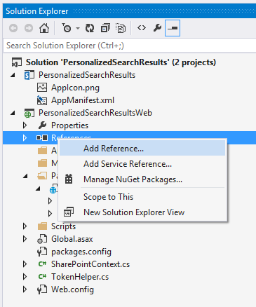  
2.  Click __Browse...__
3.  Move to the folder __C:\Program Files\Common Files\microsoft shared\Web Server Extensions\15\ISAPI__.
4.  Select the following assemblies. You can select multiple assemblies by holding the __Ctrl__ button down while clicking the assemblies in dialog.
    *   __Microsoft.SharePoint.Client.UserProfiles.dll__
    *   __Microsoft.SharePoint.Client.Search.dll__
5.  Click __Add__.
6.  Click __OK__.
7.  Move to __Solution Explorer__, expand the __Pages__ folder, expand the __Default.aspx__ file, and open the __default.aspx.cs__ to add the needed code for actual button clicks.  
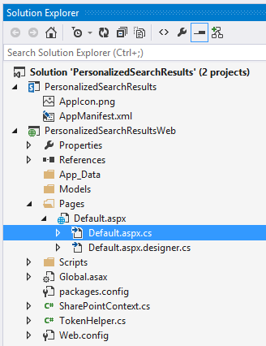  
8.  First add the required __using__ statements to the top of the code page as follows. This will ensure that the referenced SharePoint client CSOM can be easily accessed.  
  ```csharp     
    using Microsoft.SharePoint.Client;
    using Microsoft.SharePoint.Client.Search.Query;
    using Microsoft.SharePoint.Client.UserProfiles;
  ```

9.  Update the __btnPerformSearch_Click__ method as follows for controlling the host web theming settings. Notice that this method is dependent on two additional methods, which we will be adding in the following steps.
  ```csharp     
    protected void btnPerformSearch_Click(object sender, EventArgs e)
    {
      var spContext = SharePointContextProvider.Current.GetSharePointContext(Context);
      using (var clientContext = spContext.CreateUserClientContextForSPHost())
      {
          // Since in this case we want only site collections, let's filter based on result type
          string query = searchtext.Text + " contentclass:\"STS_Site\"";
          ClientResult<ResultTableCollection> results = ProcessQuery(clientContext, query);
          lblStatus1.Text = FormatResults(results);
      }
    }
  ```

10. Add the following __ProcessQuery__ method as an additional new method below the button click Eventthandlers. This method actually executes the search operation using Search CSOM.  
  ```csharp
    private ClientResult<ResultTableCollection> ProcessQuery(ClientContext ctx, string keywordQueryValue)
    {
        KeywordQuery keywordQuery = new KeywordQuery(ctx);
        keywordQuery.QueryText = keywordQueryValue;
        keywordQuery.RowLimit = 500;
        keywordQuery.StartRow = 0;
        keywordQuery.SelectProperties.Add("Title");
        keywordQuery.SelectProperties.Add("SPSiteUrl");
        keywordQuery.SelectProperties.Add("Description");
        keywordQuery.SelectProperties.Add("WebTemplate");
        keywordQuery.SortList.Add("SPSiteUrl", Microsoft.SharePoint.Client.Search.Query.SortDirection.Ascending);
        SearchExecutor searchExec = new SearchExecutor(ctx);
        ClientResult<ResultTableCollection> results = searchExec.ExecuteQuery(keywordQuery);
        ctx.ExecuteQuery();
        return results;
    }
  ```

11. Add following FormatResults method under the just added method. This method is responsible for formatting the search results to HTML format.
  ```csharp
    private string FormatResults(ClientResult<ResultTableCollection> results)
    {
        string responseHtml = "<h3>Results</h3>";
        responseHtml += "<table>";
        responseHtml += "<tr><th>Title</th><th>Site URL</th><th>Description</th><th>Template</th></tr>";
        if (results.Value[0].RowCount > 0)
        {
            foreach (var row in results.Value[0].ResultRows)
            {
                responseHtml += "<tr>";
                responseHtml += string.Format("<td>{0}</td>", row["Title"] != null ? row["Title"].ToString() : "");
                responseHtml += string.Format("<td>{0}</td>", row["SPSiteUrl"] != null ? row["SPSiteUrl"].ToString() : "");
                responseHtml += string.Format("<td>{0}</td>", row["Description"] != null ? row["Description"].ToString() : "");
                responseHtml += string.Format("<td>{0}</td>", row["WebTemplate"] != null ? row["WebTemplate"].ToString() : "");
                responseHtml += "</tr>";
            }
        }
        responseHtml += "</table>";
        return responseHtml;
    }
  ```

12. Press F5 or choose __Debug | Start Debugging__ to see the latest changes.
13. Remove the default text filter from the text query filtering and click the __Perform Simple Search__ button to see the current implementation. Notice that results are dependent on your tenant, so you should see slightly different sites listed than in below picture.  
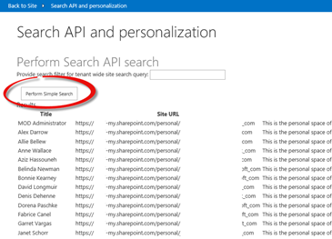
14. You can test the filtering mechanism by providing a value for the text box. Notice that we have a specific content class filter in the query to target the results on to site collections. Only those site collections which the particular user are listed in the results.
15. Move back to Visual Studio side and press __Shift+F5__ or choose __Stop Debugging__ from the __Debug__ menu.
16. Open the __default.aspx.cs__ file again, and include the personalized search option to it.
17. Update the __btnPersonalizedSearch_Click__ method as follows. We will be doing alternative search query based on user property values. This kind of pattern could be used to filter for example news or documents in the search results. Alternatively you could target different URLs based on the property values. In this case demonstration is pretty simple, but the pattern is extremely powerful.

   ```csharp
   protected void btnPersonalizedSearch_Click(object sender, EventArgs e)
   {
        var spContext = SharePointContextProvider.Current.GetSharePointContext(Context);
        using (var clientContext = spContext.CreateUserClientContextForSPHost())
        {
            // Load user profile properties
            PeopleManager peopleManager = new PeopleManager(clientContext);
            PersonProperties personProperties = peopleManager.GetMyProperties();
            clientContext.Load(personProperties);
            clientContext.ExecuteQuery();
            // Check the value for About Me to investigate current values
            string aboutMeValue = personProperties.UserProfileProperties["AboutMe"];
            string templateFilter = ResolveAdditionalFilter(aboutMeValue);
            // Let's build the query
            string query = "contentclass:\"STS_Site\" " + templateFilter;
            ClientResult<ResultTableCollection> results = ProcessQuery(clientContext, query);
            lblStatus2.Text = FormatResults(results);
        }
    }
   ```
18. Add also ResolveAdditionalFilter helper method as follows. Review the just added code. Notice that we access the user profile. Check if the user profile property called AboutMe has specific value. This drives the search keyword query.

  ```csharp
    private string ResolveAdditionalFilter(string aboutMeValue)
    {
        if (!aboutMeValue.Contains("AppTest"))
        {
            return "WebTemplate=STS";
        }
        return "";
    }
  ```
19. Press __F5__ or choose __Debug | Start Debugging__ to see the latest changes.
20. Click the __Perform Personalized Search__ button to perform a query based on your user profile properties. Notice that results are dependent on your tenant, but the results are different now, since we only show sites which have been created using out of the box team site template.
21. Confirm the alternative results by modifying the user profile. Click first __Back to Site__ from the top left corner.
22. Click __Newsfeed__ from the top navigation.  

23. Click __About Me__ from the left navigation.
24. Click __edit your profile__.
25. Add additional text with __AppTest__ to the __About me__ text box and click __Save all and close__.
26. Click __OK__.
27. Move back to the developer site in the address of __http://[yourtenant]/sites/dev__.
28. Locate __PersonalizedSearchResults__ from the left navigation.
29. Click __Perform Personalized Search__ and confirm that the results have not changed.  
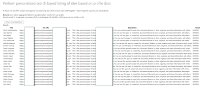

That completes this exercise. You have now built a provider hosted app, which shows results based on the user profile properties values, and uses search to aggregate the data. You can also use a similar kind of pattern with JavaScript based implementations.

## Exercise 2: Customize Search Result Presentation

### Abstract

In this lab you will modify the display templates for the search results to provide customized end user presentation.

### Learning Objectives

After completing the exercises in this lab, you will be able to:

* Create new display templates.
* Associate new display templates to search results.

#### Estimated time to complete this lab: 15 minutes

### Create and Crawl the Glossary List.

In the first set of tasks in this scenario, you will create a glossary list of definitions and site columns for the list. You will then you populate the list with the glossary data. Finally, you will crawl the list and verify that it is searchable.

1.  Create the list.

    * Click the __Settings__ button (gear icon) in the top right, and then click Site Contents.
    * Navigate to the Site Contents page of the root site of the Site Collection at http://[yourtenant].sharepoint.com/sites/dev.
    * Click Add an app.
    * Click Custom List.
    * In the Name box, type Glossary, and then click Create.

2.  Create site columns.
    * __Navigate__ to __Site Settings__ page for the __Site Collection__.
    * In the __Web Designer Galleries__ section, click __Site columns__.
    * On the site columns page, click __Create__.
    * In the __Column name__ box, type __Product__.
    * For type, select __Single line of text__.
    * Click __OK__
    * On the site columns page, click __Create__.
    * In the Column name box, type __Related Term 1__.
    * For type, select __Single line of text__.
    * Click __OK__
    * On the site columns page, click __Create__
    * In the __Column name__ box, type __Related Term 2__.
    * For type, select Single line of text.
    * Click __OK__.
    * On the site Columns page, click __Create__.
    * In the __Column name__ box, type __Definition__.
    * For type, select __Multiple lines of text__.
    * In the __Additional Column Settings__ section, select __Plain text__ for Specify the type of text to allow.
    * Click __OK__.
3. Add columns to list.
    * __Navigate__ to the glossary list you created earlier.
    * In the __List Tools__ ribbon, click the __List__ tab, and then click __List Settings__.
    * In the __Columns__ section, click __Add from existing site columns__.
    * In the __Select Columns__ section, select __Custom Columns__ from the dropdown menu.
    * Select __Product__ from the Available site columns list, and then click __Add__.
    * Select __Related Term 1__ from the Available site columns list, and then click __Add__.
    * Select __Related Term 2__ from the Available site columns list, and then click __Add__.
    * Select __Definition__ from the Available site columns list, and then click __Add__.
    * Click OK.
    * In the __Views__ section of the List Settings, click __All Items__.
    * In the __Columns__ section, check the __Display__ checkbox for ID, and change the __Position from Left__ value to __1__.
    * Change the __Position from Left__ value for __Product__ to __2__.
    * Click __OK__ to save your changes to the All Items view.  
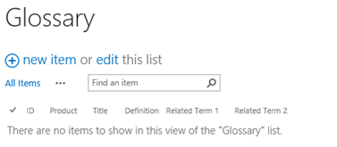
4. Disable attachments
    * In the __List Tools__ ribbon, click the __List tab__, and then click __List Settings__.
    * In the __General Settings__ section, click __Advanced Settings__.
    * In the __Attachments__ section, select __Disabled__, and then click __OK__.
    * Click __OK__ on the message from webpage dialog that opens.
5. Import data
    * __Navigate__ to the default view of the glossary list.
    * In the __List Tools__ ribbon, click the __List__ tab.
    * Click __Open with Access__.
    * Confirm that __Link to data on the SharePoint__ site is selected, and then click __OK__.
    * Once the list is open in Access, on the __External Data__ tab, in the __Import &amp; Link__ group, click __Excel__.
    * In the __Get External Data - Excel Spreadsheet__ dialog box, click __Browse__.
    * Locate the __Terms.xlsx__ worksheet and click __Open__.
    * Select __Append a copy of the records to the table__, ensure that Glossary is selected in the drop-down list, and then click __OK__.
    * In the __Import Spreadsheet Wizard__, click __Next__, then click __Next__ again. Now click __Finish__.
    * In the __Save Import Steps__ dialog, click __Close__.
    * Open the __Glossary__ table in __Access__, and confirm that the data was imported.
    * __Refresh__ the __Glossary__ list page in the browser, and confirm that the glossary data was imported to the list.
    * __Close__ Access.
6.  Perform a full crawl.
    * Navigate to the __Site Settings__ page.
    * Under the __Search Category__ click on the __Search and Offline Availability__ link.
    * Scroll to the bottom of this page and click the __Reindex site__ button.
    * A dialog will pop up. Click the option to __Reindex Site__.  
    __Note__: Wait for the site to be crawled. One way to know that the crawl is complete is to search for a term which was just added to the glossary list if a result is returned then the index should be up to date.
7.  Verify metadata properties.
    * Navigate to the __Site Settings__ page.
    * Under the __Search Category__ click on the __Schema__ link.
    * In the managed property filter type in each of the terms listed below. If one metadata property exist matching each property then a mapping exists for each list property.
        * DefinitionOWSMTXT
        * ProductOWSTEXT
        * RelatedTerm1OWSTEXT
        * RelatedTerm2OWSTEXT
8.  Perform a test search.
    * __Navigate__ to the __home page__ of the site collection.
    * Type "__Argument__" in the search box at the top of the page. Click the __Search__ button.
    * Verify that search results are returned from the glossary list.

### Create the Search UI.
In this next set of tasks, you create the user interface (UI) for the glossary search vertical. This interface will consist of a separate view dedicated solely to glossary search results as well as a "block" view within the main search results experience. In practice, you can choose to implement one, the other, or both views in a solution.  
The developer template does not have a search center so before you can proceed with this demo you must ensure that the site has a search center.  

1. Activate the site collection publishing infrastructure.
    * __Navigate__ to the __Site Settings__ Page.
    * Under the __Site Collection Administration Section__ click on the __Site Collection Features__ link.
    * Scroll down to the __SharePoint Server Publishing Infrastructure__ feature and click the __Activate__ button if feature is not currently enabled.
    * __Navigate__ back to the __site settings__ page.
    * Under the __Site Actions section__ click the __Manage site features__ link.
    * Scroll down to the __SharePoint Server Publishing__ feature and click the __Activate__ button, if feature is not currently enabled.
2.  Create a search center site.
    * __Navigate__ to the __Site Contents Page__ of the root site in the site collection.
    * At the bottom of the page click the link to __add a new subsite__.
    * Type "__Search__" into the title field.
    * Type "__Search__" in the subsite name field.
    * In the __Select Template__ section, click on the __Enterprise__ tab. Once the Enterprise tab is selected, choose the __Enterprise Search Center__ site template.
    * Click the __Create__ button.
3.  Create a page.
    * __Navigate__ to the __Site Contents__ page in the __Search Center site__.
    * Click __Pages__.
    * In the __Library Tools__ ribbon, click the __Files__ tab, and then click __New Document__.
    * Type __Glossary__ in the title box, type __glossaryresults__ in the __URL Name__ box, select __(Welcome Page) Search Results__ for page layout, and then click __Create__.
    * Click the link for the __glossaryresults.aspx__ page.
    * On the glossaryresults.aspx page, click the __Check It In__ link and click __OK__ for the comments dialog.
    * Click the __Publish It__ link to publish the page.
4.  Connect to search navigation.
    * In the __Search Center__, click the __Site__ menu, and then click __Site Settings__.
    * Click __Search Settings__ in the __Search__ group.
    * In the __Configure Search Navigation__ section, click __Add__ link.
    * Type __Glossary__ in the __Title__ field.
    * Click __Browse__.
    * Click the __Pages__ library and then the __glossaryresults.aspx__ page.
    * Click __Insert__.
    * Click __OK__.
    * Click __OK__ again.
Continue by creating a result source for glossary search results. The result source will then be filtered using a query transformation. This will allow the search vertical to show only results from the glossary list. This is the equivalent of a scope in previous versions of SharePoint.
5. Create the results source.
* Open the __Search Center__.
* Click the __Site__ menu, and then click __Site Settings__.
* Under __Search__, click __Result Sources__.
* On the __Manage Result Sources__ page, click __New Result Source__.
* In the __Source Name__ box, type "__Glossary__".
* Ensure that the options __Local SharePoint Index__, __SharePoint Search Results__, and __Default Authentication__ are selected.
* In the __Query Transformation__ box, type the following query:
__{searchTerms} contentclass:STS_ListItem_GenericList AND path:https://[YOUR-DEVELOPER-TENANT-NAME].sharepoint.com/sites/developersite/lists/glossary__  
Note: The path element must correspond to the location of the glossary list in your environment. Everything highlighted will be different and it should match the details of the site where you are working.
* Click __Save__.

### Create the Result Type and Template
Now we will create a result type and template for displaying search results. The result type acts as a rule to determine when to apply special formatting to the search results. The special formatting is defined in an HTML template.

1.  Create a display template.
    * Open __DefaultGlossary_Orig.html__ with __Microsoft Visual Studio__. This file can be found in the __O3658-9 Demos/SearchUICustomizations__ folder.
    * Paste the following code immediately below the line: &lt;!--Paste code below this line--&gt;

        <!-- Use the following line to cause the debugger to attach -->
        <!--#_ debugger;  _#-->
        <div id="_#= $htmlEncode(itemId) =#_" name="Item" data-displaytemplate="DefaultItem" class="ms-srch-item" onmouseover="_#= ctx.currentItem_ShowHoverPanelCallback =#_" onmouseout="_#= ctx.currentItem_HideHoverPanelCallback =#_">
            _#=ctx.RenderBody(ctx)=#_
            <div id="_#= $htmlEncode(hoverId) =#_" class="ms-srch-hover-outerContainer"></div>
            <!--#_ if(!$isNull(ctx.CurrentItem.Product)){ _#-->
            <div><b>Product: _#=ctx.CurrentItem.Product=#_ </b></div>
            <div>Related 1: _#=ctx.CurrentItem.RelatedTerm1OWSTEXT=#_ </div>
            <div>Related 2: _#=ctx.CurrentItem.RelatedTerm2OWSTEXT=#_ </div>
        <!--#_ } _#-->
        </div>

    * __Save__ the file as __DefaultGlossary.html__.  
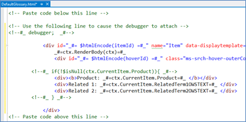
2. Upload the Display template
    * __Navigate__ to the __Search Center__.
    * Click the __Site__ menu, and then click __Site Settings__.
    * In the __Web Designer Galleries__ section, click __Master Pages and Page layouts__ to open the Master Page Gallery.
    * Click __Display Templates__, and then click __Search__.
    * Click the __Files tab__ in the Library Tools ribbon, and then click __Upload Document__.
    * Browse to locate the __DefaultGlossary.html__ file, and then click __OK__.
    * Click __Save__.
    * Choose the __DefaultGlossary.html__ file and choose __Publish a Major Version__.
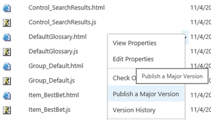
3.  Create a result type.
    * __Navigate__ to the __Search Center__.
    * Click the __Site__ menu, and then click __Site Settings__.
    * Under __Search__, click __Result Types__.
    * Click __New Result Type__.
    * Type __Glossary Result__ in the __Give It A Name__ field.
    * In the __Conditions__ section, select __Glossary__ in the __Which Source Should Results Match?__ dropdown menu.
    * In the __Actions__ section, select __Default Glossary__ in the __What Should These Results Look Like?__ dropdown list.
    * Click __Save__.

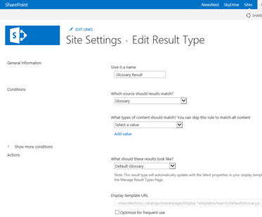  
As a following step you will add a results block to show the glossary results in a separate block from the main results.

1.  Create a glossary rule.
    * Navigate to __Search Center__.
    * Click the __Site__ menu, and then click __Site Settings__.
    * Under __Search__, click __Query Rules__ to open the __Manage Query Rules__ page.
    * Select __Local SharePoint Results__ from the __Select a Source__ dropdown.
    * Click __New Query Rule__.
    * In the __Rule Name__ box, type __Glossary Core__.
    * In __Query Conditions__, click __Remove Condition__ to remove the default condition.
    * In the __Actions__ section, click __Add Result Block__.
    * Expand __Settings__.
    * Select __This Block is Always Shown Above Core Results__.
    * Select __Glossary__ from the __Search This Source__ dropdown list.  
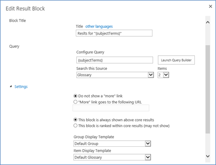  
    * Click __OK__.
    * Click __Change Ranked Results by Changing the Query__.
    * In the select a query dropdown, change the query to __Local SharePoint Results (System)__.
    * In the query box, type the following query:
__{searchTerms} NOT(contentclass:STS_ListItem_GenericList AND path:https://[YOUR-DEVELOPER-TENANT-NAME].sharepoint.com/sites/developersite/lists/glossary)__  
__Note__: The path element must correspond to the location of the glossary list in your environment.
    * Click __OK__.
    * Click __Save__.
2.  Bind the result source to the search result web part. 
    * __Navigate__ to __glossaryresults.aspx__.
    * Click the __Site__ menu, and then click __Edit Page__.
    * In the __Search Results__ web part, select __Edit Web Part__.
    * In the __Search Criteria__ category, click __Change query__.
    * In the __Select Result Source__ dropdown list, select __Glossary__.
    * In the __Query__ text area, type the following query:
__{searchboxquery}__  
__Note:__ The path element must correspond to the location of the Glossary list in your environment.  
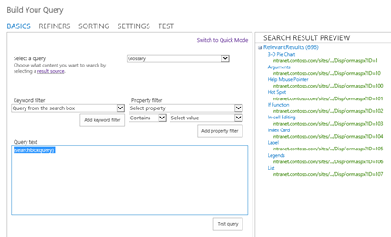  
Bind Result Source to Search Results web part
    * Click __OK__.
3.  Under __Display Templates__, choose __Use a single display template to display items__ and change the drop down to __Default Glossary__.  
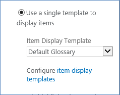  
4.  Click OK (make sure to do this or results will not be formatted correctly).
5.  After saving changes to the web part, publish the page.
    * On the yellow bar at the top of the page, click Check it in. Click Continue.
    * Click Publish this draft.
6.  Test the page.
    * Navigate to
__http://[TENANT-NAME].sharepoint.com/sites/[DEVELOPER SITE NAME]/search__
    * Click on the glossary tab. In the keyword query box, type __Tab__.  
__Note__: if you left the line in the display template that includes "debugger;" you will be prompted to launch the debugger for each rendered result. To avoid this behavior, edit the DefaultGlossary.html file and remove that line and upload the template again.
    * Click __Search__ and verify that you get results only from the glossary list and that results are customized with our display template.  
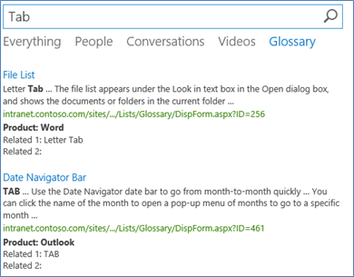  
    * Click the __Everything__ link on the page and verify that you get results from all sources, but that the glossary results appear in a separate block.  
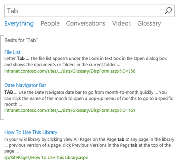  
